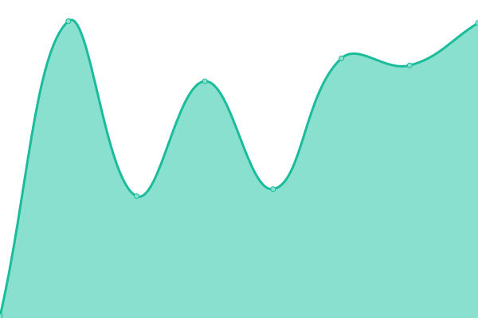
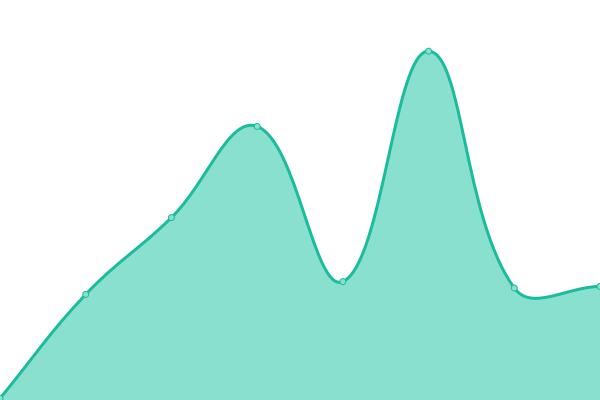

# [📈 Live Status](https://status.crossid.io): <!--live status--> **🟧 Partial outage**

This repository contains the open-source uptime monitor and status page for [crossid](https://status.crossid.io), powered by [Upptime](https://github.com/upptime/upptime).

With [Upptime](https://upptime.js.org), you can get your own unlimited and free uptime monitor and status page, powered entirely by a GitHub repository. We use [Issues](https://github.com/crossid/status/issues) as incident reports, [Actions](https://github.com/crossid/status/actions) as uptime monitors, and [Pages](https://status.crossid.io) for the status page.

<!--start: status pages-->
<!-- This summary is generated by Upptime (https://github.com/upptime/upptime) -->
<!-- Do not edit this manually, your changes will be overwritten -->
<!-- prettier-ignore -->
| URL | Status | History | Response Time | Uptime |
| --- | ------ | ------- | ------------- | ------ |
|  [US production cluster](https://crossid.us.crossid.io/api/cluster/v1/health/ready) | 🟩 Up | [us-production-cluster.yml](https://github.com/crossid/status/commits/HEAD/history/us-production-cluster.yml) | 

 197ms
     
 | 

<a href="https://status.crossid.io/history/us-production-cluster">100.00%</a>
    

|  [US preview cluster](https://crossid.us.preview.crossid.io/api/cluster/v1/health/ready) | 🟥 Down | [us-preview-cluster.yml](https://github.com/crossid/status/commits/HEAD/history/us-preview-cluster.yml) | 

 0ms
     
 | 

<a href="https://status.crossid.io/history/us-preview-cluster">0.00%</a>
    

|  [US development cluster](https://crossid.us.dev.crossid.io/api/cluster/v1/health/ready) | 🟩 Up | [us-development-cluster.yml](https://github.com/crossid/status/commits/HEAD/history/us-development-cluster.yml) | 

 125ms
     
 | 

<a href="https://status.crossid.io/history/us-development-cluster">100.00%</a>
    

|  [Crossid.io](https://crossid.io) | 🟩 Up | [crossid-io.yml](https://github.com/crossid/status/commits/HEAD/history/crossid-io.yml) | 

 321ms
     
 | 

<a href="https://status.crossid.io/history/crossid-io">100.00%</a>
    

<!--end: status pages-->

[**Visit our status website →**](https://status.crossid.io)

## 📄 License

- Powered by: [Upptime](https://github.com/upptime/upptime)
- Code: [MIT](./LICENSE) © [crossid](https://status.crossid.io)
- Data in the `./history` directory: [Open Database License](https://opendatacommons.org/licenses/odbl/1-0/)
